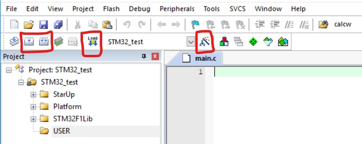

# Keil之新建工程
---
本节介绍在Keil环境下新建工程的相关操作，包括`基于固件库的MDK5工程模板建立`和`工程配置相关说明`。Keil下的新建工程比熟悉的Visual Studio显得要繁琐许多，完成工程时可在工程模板的基础上写入核心代码，以下内容可以跟着走一遍流程，也可跳到`工程配置说明`部分，利用`STM32-DEMO\Projects\project.Uvproj`直接开始代码的编写，其它只当做说明文件在需要时再做参考。样例以STM32F103RCT6型号为参照。

主要参考资料来自正点原子《STM32F1开发指南-库函数版本》和往届的工程配置说明。

---
所需文件：
-官方固件包 `STM32F10x_StdPeriph_Lib_V3.5.0.zip`
-Demo文件`STM32-DEMO.zip`

下载地址：
<http://openedv.com/posts/list/6054.htm>

## 基于固件库的MDK5工程模板建立
1. 在电脑某个目录下建立一个新文件夹，存放之后的工程相关文件，比如`STM32_test`. 在文件夹里建立子文件夹`User`、`Projects`和`Platform`。
（具体管理方式看个人喜好，更重要的是弄清楚每一部分文件的作用）
其中：
  * `User`顾名思义是用于保存自己编写的代码.h文件和.c文件
  * `Projects`用于存放工程文件，内部可建立一个`Output`文件夹来保存输出文件
  * `Platform`用于保存端口初始化和中断的操作

2. 打开所需的官方固件包。
  * 将文件夹`STM32F10x_StdPeriph_Lib_V3.5.0\Libraries\STM32F10x_StdPeriph_Driver`复制到刚刚建立的根文件夹里，作为库文件，其中`src`文件夹存放的是固件库的.c文件，`inc`存放的是对应的.h文件

  * 将文件夹`STM32F10x_StdPeriph_Lib_V3.5.0\Libraries\CMSIS\CM3\DeviceSupport\ST\STM32F10x\startup\arm`中的`startup_stm32f10x_hd.s`复制到刚刚建立的`Projects`文件夹下，是对应于大容量芯片的启动文件

  * 将`STM32F10x_StdPeriph_Lib_V3.5.0\Libraries\CMSIS\CM3\DeviceSupport\ST\STM32F10x`目录下的三个文件`stm32f10x.h`、`system_stm32f10x.c`、`system_stm32f10x.h`和
  `STM32F10x_StdPeriph_Lib_V3.5.0\Project\STM32F10x_StdPeriph_Template`目录下的`stm32f10x_conf.h`、`stm32f10x_it.c`、`stm32f10x_it.h`、`system_stm32f10x.c`复制到`Platform`文件夹下。

3. 打开软件，在工具栏选择`Project->New Uvision Project`,定位在刚刚建立的`Projects`目录下

4. 选择与芯片相对应的CPU型号，此处选择`STMicroelectronics`目录下的`STM32F103RC`
（相关包`Keil.STM32F1xx_DFP.2.2.0.pack`已安装）

5. 点击`OK`，会弹出`Manage Run-Time Environment`对话框，可以添加自己需要的组建方便构建开发环境，此处仅需点击`Cancel`

6. 接下来需要将刚刚建立好的文件系统加入到工程中。右键点击`Target1`，选择`Manage Project Items`

7. `Project Targets`一栏，双击将`Target 1`改为工程的名字`STM32-test`,在`Groups`一栏删掉`Source Group1`,新建`USER`、`Platform`、`STM32F1Lib`、`StartUp`的`Groups`

8. 选中特定的Groups,点击`Add Files`,定位到刚才建立的目录里。将`Platform`里的.c文件加入到对应的*Group*,将`src`文件里的文件加入到`STM32F1Lib`，将`Projects`里对应的启动文件加入到`StartUp`,注意更改文件类型为`All files`才可以看到.s的文件。
点`OK`后就可以看到这样的工程文件系统了。

## 工程配置说明

Keil5上方工具栏如下图：

红圈内从左至右依次为：
  * 编译目标文件，即只会编译被修改过的文件，通常编译时只选择该按钮。
  * 重新编译所有文件
  * 使用下载器将编译后的二进制程序下载到STM32芯片
  * 配置整个工程的属性，较为重要，包括芯片类型、依赖文件目录，仿真器选择等

  如果直接在新建工程之后点击编译按钮，会看到非常多的报错，于是我们点击最后一个“魔术棒”按钮，进入工程配置页面。

* `Device`选项卡下可选择芯片类型，也就是我们在新建工程的时候进行的过程。
* `Target`选项卡中`Xtal(MHz)`表示晶振的频率，对于STM32使用的外部时钟的频率均为8M，故填写8M。在IROM1和IRAM1中填写的是ROM和RAM的起始地址，在后续的工作中都不需修改。整体结果如下：

* `Output`选项卡，进行文件的输出设置。左上角`Select Folder`选项可将输出文件默认定位在`Projects\Output`中。右上角为可执行文件的名称，默认为工程名，不必修改。下方是选择输出文件的目标文件夹和生成的文件，三个复选框全部选中。

* `Listing`选项卡，同样左上角`Select Folder`选项可将输出文件默认定位在`Projects\Output`中。自此我们可以删除系统自动生成的Object和Listing文件夹，相关文件均会存入Output文件夹。

* `C/C++`选项卡

在`Include Paths`右侧点击`...`加入头文件的目录，在Define框里加入宏定义`STM32F10X_HD, USE_STDPERIPH_DRIVER`，最终结果如上图。

* `Debug`选项卡，选择右上方调试工具为`ST-Link Debugger`,即用STLINK提供硬件支持，实现断点调试。

* `Utilities`选项卡，同样选定`ST-Link Debugger`,点击`Settings`,跳出如下对话框

左上角的几个选项必须按照上图所示方式选择，中间的表格唯一的一行应如图所示，否则用`Add`或者`Remove`进行更改。然后上方切换到到`Debug`选项卡，将`Port`选为`SW`，设置下载器的连接方式，如果STLink连接正常应该会出现下图的界面，其中`Unit`指示连接状态：

点击`OK/确认`回到主界面。自此所有设置结束。

如果是新建工程，那么可以开始主函数文件代码的相关编写。
如果是利用的`STM32-DEMO`文件，那么可以点击编译按钮，进行编译，没有Error和Warning说明编译成功，点击`LOAD`按钮进行烧写，窗口下方出现进度条，进度条完成后，观察系统板上LED的情况，如果1s亮1s灭循环则说明程序烧写成功。