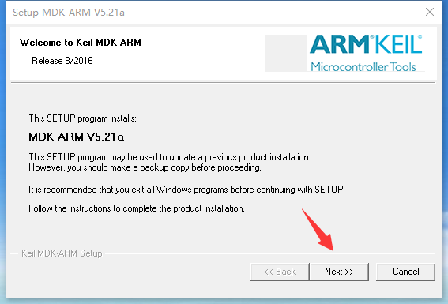
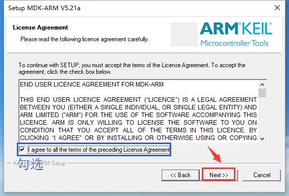
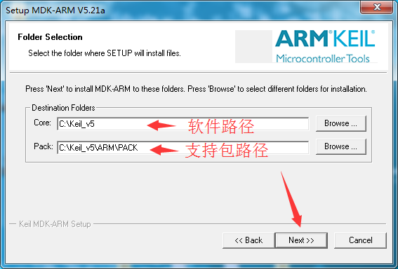
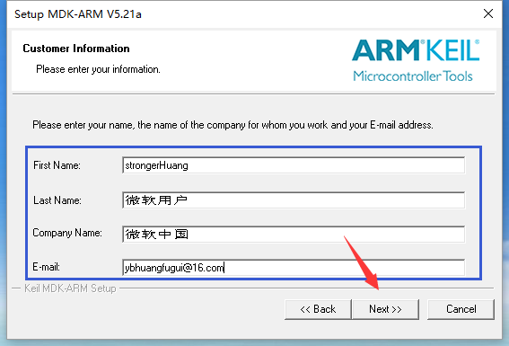
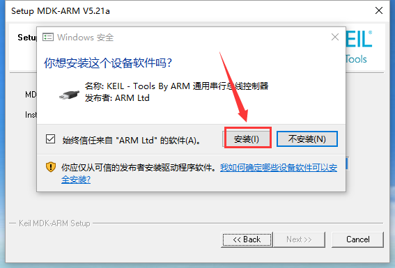
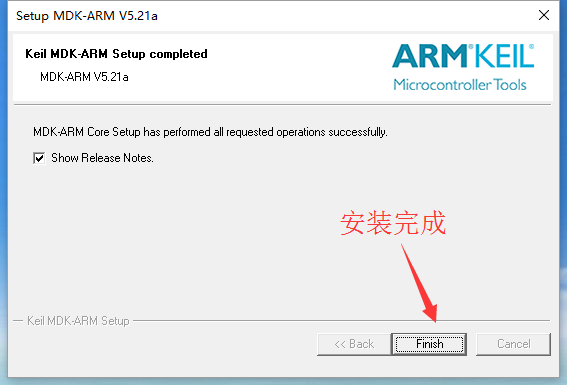
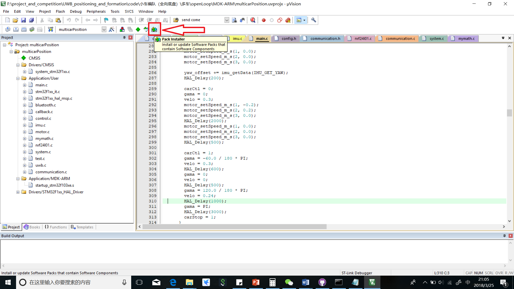
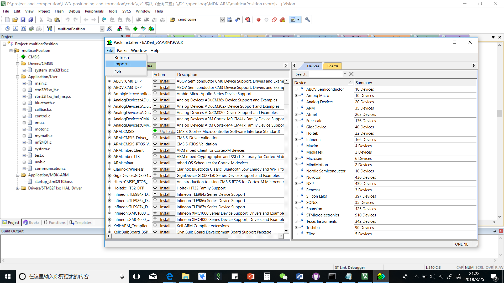
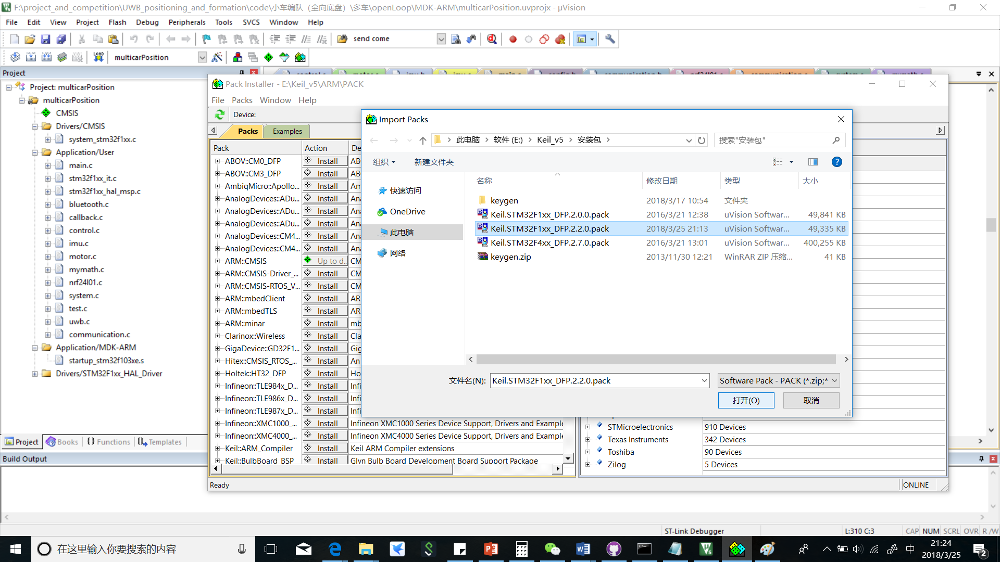

# Keil MDK-ARM

本章介绍Keil MDK-ARM的安装。Keil MDK-ARM是美国Keil软件公司（现已被ARM公司收购）出品的支持ARM微控制器的一款IDE（集成开发环境）。

MDK-ARM包含了工业标准的Keil C编译器、宏汇编器、调试器、实时内核等组件。具有业行领先的ARM C/C++编译工具链，完美支持Cortex-M、Cortex-R4、ARM7和ARM9系列器件，包含世界上品牌的芯片。比如：ST、Atmel、Freescale、NXP、TI等众多大公司微控制器芯片。

# 安装方法

所需文件：
- `MDK524a.exe`
- `Keil.STM32F1xx_DFP.2.2.0.pack`

下载地址：
<http://www.keil.com/download/product>

## 安装流程

1.下载软件，双击安装包，进入安装向导界面，点击“Next”

2.勾选“I agree to...”，点击“Next”

3.选择软件和支持包安装路径（可以默认），点击“Next”

4.填写信息（可以随便填写），点击“Next”

5.安装过程需要等待几分钟

6.安装结束时，弹出下图提示，选择“安装”

7.安装完成，点击“Finish”

8.自动更新“支持包”，可以直接退出，自己下载安装。

9.打开软件，点击“Pack Installer”

10.点击“File-Import”

11.找到安装包`Keil.STM32F1xx_DFP.2.2.0.pack`，点击打开，等待其安装完即可

